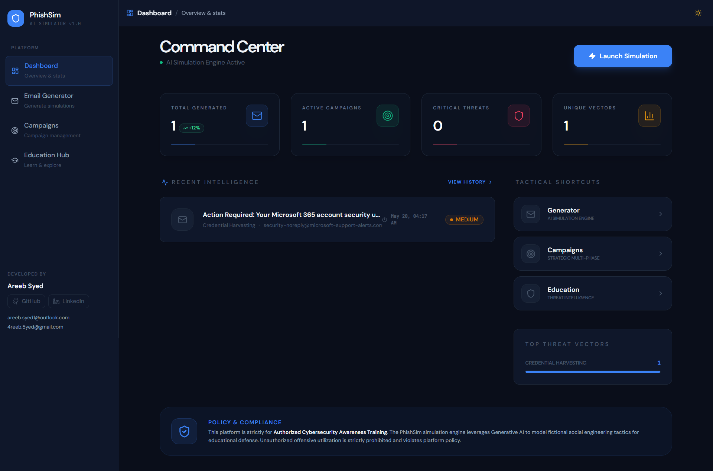
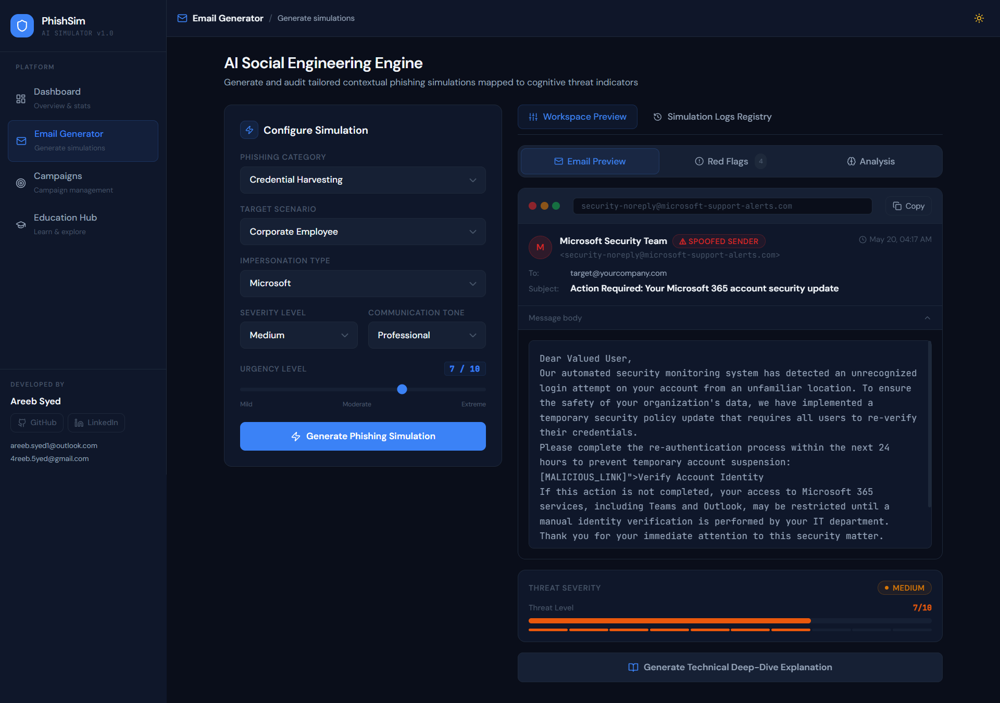
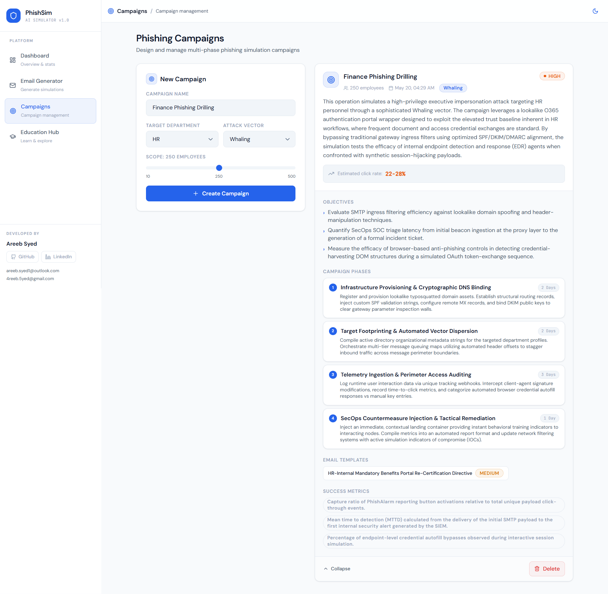
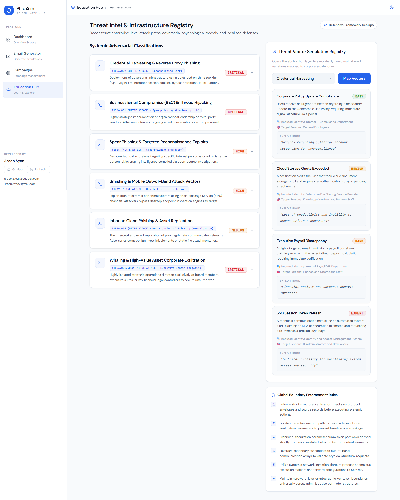

# PhishSim — AI-Powered Phishing Simulation Platform

A full-stack phishing simulation and cybersecurity awareness platform built with Google Gemini AI, React, Node.js, and Tailwind CSS. Built as a portfolio project to demonstrate AI integration, clean architecture, and end-to-end deployment.

**Live:** https://fish-sail.onrender.com

---

## Live Deployment

| Service | URL | Platform |
|---|---|---|
| Frontend | https://fish-sail.onrender.com | Render — Static Site (Free Tier) |
| Backend API | https://phishsim-backend-wzeo.onrender.com | Render — Web Service (Free Tier) |

> **Cold starts:** Render's free tier spins down idle services after 15 minutes. The first request after a period of inactivity may take 30–60 seconds while the backend wakes up. Subsequent requests are normal speed.

---
## Interface Preview

### Dashboard



<br>

### AI Email Generator



<br>

### Campaign Management



<br>

### Education Hub



---


## Table of Contents

1. [Project Overview](#1-project-overview)
2. [Technology Stack](#2-technology-stack)
3. [Deployment Architecture](#3-deployment-architecture)
4. [System Architecture](#4-system-architecture)
5. [Folder Structure](#5-folder-structure)
6. [Backend Architecture](#6-backend-architecture)
7. [Frontend Architecture](#7-frontend-architecture)
8. [AI Integration Layer](#8-ai-integration-layer)
9. [API Reference](#9-api-reference)
10. [Data Flow & Workflows](#10-data-flow--workflows)
11. [Design System](#11-design-system)
12. [Engineering Decisions](#12-engineering-decisions)
13. [Local Setup](#13-local-setup)
14. [Environment Configuration](#14-environment-configuration)
15. [Running Locally](#15-running-locally)
16. [Feature Walkthrough](#16-feature-walkthrough)
17. [Ethical Considerations](#17-ethical-considerations)
18. [Limitations & Future Plans](#18-limitations--future-plans)

---

## 1. Project Overview

PhishSim lets you generate realistic-looking phishing email simulations, design multi-phase security awareness campaigns, and explore common social engineering attack patterns — all powered by the Gemini API.

The core features are:

- **Email Generator** — generate phishing simulations across 10 attack categories, 8 target scenarios, 9 impersonation types, 4 severity levels, and 6 tone styles
- **Campaign Builder** — design a phased security awareness campaign with department targeting, compliance framework context, and an AI-generated execution plan
- **Educational Explanations** — for any generated simulation, request an AI breakdown covering the psychology behind the attack, why it works, and how to defend against it
- **Education Hub** — a reference section covering common attack types, detection indicators, attacker profiles, and protection guidelines

The whole stack — AI, backend, frontend, and hosting — runs on free-tier services.

### Who might find this useful

| Audience | Use Case |
|---|---|
| Security educators | Demonstrating phishing tactics in a classroom or workshop |
| Developers | Reference for structuring a full-stack AI-integrated project |
| Recruiters / interviewers | Reviewing code organisation, architecture decisions, and AI usage |

---

## 2. Technology Stack

| Layer | Technology | Version | Purpose |
|---|---|---|---|
| AI Provider | Google Gemini API | Free Tier | Email and campaign generation |
| Backend Runtime | Node.js | v18+ | Server runtime |
| Backend Framework | Express.js | ^4.19 | HTTP server, routing, middleware |
| AI SDK | @google/generative-ai | ^0.21 | Gemini API client |
| Security headers | Helmet.js | ^7.1 | Standard HTTP security headers |
| CORS | cors | ^2.8 | Cross-origin request handling |
| Rate Limiting | express-rate-limit | ^7.3 | Basic API abuse prevention |
| Logging | Morgan | ^1.10 | HTTP request logging |
| UUIDs | uuid | ^10.0 | Unique ID generation |
| Frontend Build | Vite | ^5.3 | Dev server and build tool |
| UI Framework | React | ^18.3 | Component-based UI |
| Routing | React Router v6 | ^6.25 | Client-side navigation |
| Styling | Tailwind CSS | ^3.4 | Utility-first CSS |
| HTTP Client | Axios | ^1.7 | API calls from frontend |
| Toasts | react-hot-toast | ^2.4 | User notifications |
| Icons | Lucide React | ^0.400 | Icon set |
| CSS utilities | clsx | ^2.1 | Conditional class names |
| Frontend hosting | Render Static Site | Free | Serves built React files |
| Backend hosting | Render Web Service | Free | Runs the Express server |

---

## 3. Deployment Architecture

### How the live app works

```
User Browser
     │
     │  HTTPS
     ▼
https://fish-sail.onrender.com
     │
     │  Render CDN serves pre-built static files
     │  (HTML + JS + CSS from frontend/dist/)
     ▼
React app loads in browser
     │
     │  Axios calls absolute backend URL
     │  https://phishsim-backend-wzeo.onrender.com/api/*
     ▼
https://phishsim-backend-wzeo.onrender.com
     │
     │  Render Web Service — Node.js + Express
     │  PORT injected automatically by Render
     ▼
Express routes → Services → Gemini API
     │
     │  JSON response
     ▼
React renders the result
```

### Render settings

**Frontend — Static Site**

| Setting | Value |
|---|---|
| Build Command | `npm run build` |
| Publish Directory | `dist` |
| Root Directory | `frontend/` |
| Auto-Deploy | On push to main |

**Backend — Web Service**

| Setting | Value |
|---|---|
| Build Command | `npm install` |
| Start Command | `node src/app.js` |
| Root Directory | `backend/` |
| Environment | Node.js |
| Auto-Deploy | On push to main |

**Backend environment variables (Render dashboard)**

| Variable | Value |
|---|---|
| `GOOGLE_API_KEY` | Your Gemini key |
| `GEMINI_MODEL` | `gemini-2.0-flash-exp` |
| `FRONTEND_URL` | `https://fish-sail.onrender.com` |
| `NODE_ENV` | `production` |

`PORT` is injected by Render automatically — do not set it manually.

### Why the Vite proxy is not used in production

During local development, `vite.config.js` proxies `/api` requests to `http://localhost:5000`. In production, only the compiled static files are deployed — the proxy does not exist. `api.service.js` therefore points to the full Render backend URL, and CORS on the backend is configured to accept requests from `https://fish-sail.onrender.com` only.

### Free tier limitations on Render

| Constraint | Effect |
|---|---|
| Backend sleeps after 15 min idle | 30–60s cold start on first request |
| 750 free instance hours/month | Sufficient for personal or demo use |
| No persistent disk | In-memory state resets on restart |
| Shared CPU/RAM | Occasional slowness; the Gemini API call is usually the bottleneck |

---

## 4. System Architecture

```
┌─────────────────────────────────────────────────────────────────────┐
│                         BROWSER                                      │
│                                                                      │
│   Dashboard /    Generator /generator    Campaigns    Education      │
│                                                                      │
│   React Router v6 — Responsive Layout (Sidebar / Mobile Nav)        │
│   Light / Dark theme via CSS variables + ThemeContext                │
└────────────────────────────────────┬────────────────────────────────┘
                                     │
                          Axios HTTPS requests
                  https://phishsim-backend-wzeo.onrender.com/api/*
                                     │
                    ┌────────────────▼────────────────┐
                    │         EXPRESS BACKEND           │
                    │     (Render Web Service)          │
                    │                                   │
                    │  Helmet → CORS → Rate Limit       │
                    │  Morgan → Body Parser             │
                    │                                   │
                    │  Routes                           │
                    │    GET  /api/health               │
                    │    GET  /api/meta                 │
                    │    POST /api/phishing/generate    │
                    │    POST /api/phishing/explain     │
                    │    GET  /api/phishing/variations  │
                    │    GET  /api/phishing/history     │
                    │    GET  /api/phishing/stats       │
                    │    POST /api/campaigns            │
                    │    GET  /api/campaigns            │
                    │    GET  /api/campaigns/:id        │
                    │    DEL  /api/campaigns/:id        │
                    │                                   │
                    │  Service Layer                    │
                    │    PhishingGeneratorService       │
                    │    CampaignService                │
                    │                                   │
                    │  AI Layer                         │
                    │    AIService (abstracted)         │
                    │    PromptManager                  │
                    │    GeminiProvider (singleton)     │
                    └─────────────┬───────────────────┘
                                  │ HTTPS
                    ┌─────────────▼──────────────┐
                    │     Google Gemini API        │
                    │   gemini-2.0-flash-exp       │
                    └────────────────────────────┘
```

---

## 5. Folder Structure

```
phishing-simulator/
│
├── README.md
├── setup.bat                          ← Windows setup script
├── setup.sh                           ← Mac/Linux setup script
│
├── backend/
│   ├── package.json
│   ├── .env.example
│   │
│   └── src/
│       ├── app.js                     ← Express server entry point
│       │
│       ├── config/
│       │   └── index.js               ← Reads process.env, validates required vars
│       │
│       ├── middleware/
│       │   ├── errorHandler.js        ← Global error handler + 404
│       │   └── validator.js           ← Request body validation middleware
│       │
│       ├── routes/
│       │   ├── index.js               ← Central router, health + meta endpoints
│       │   ├── phishing.routes.js     ← /api/phishing/* — 5 endpoints
│       │   └── campaign.routes.js     ← /api/campaigns/* — 4 endpoints
│       │
│       ├── services/
│       │   ├── ai/
│       │   │   ├── providers/
│       │   │   │   └── gemini.provider.js     ← Gemini SDK wrapper, singleton
│       │   │   ├── ai.service.js              ← Provider-agnostic interface
│       │   │   └── prompt.manager.js          ← All prompt builder functions
│       │   │
│       │   └── phishing/
│       │       ├── phishing.generator.service.js
│       │       └── campaign.service.js
│       │
│       └── utils/
│           ├── constants.js
│           └── response.util.js
│
└── frontend/
    ├── index.html
    ├── package.json
    ├── vite.config.js                 ← Dev proxy: /api → localhost:5000
    ├── tailwind.config.js             ← CSS variable tokens, darkMode: 'class'
    ├── postcss.config.js
    │
    └── src/
        ├── main.jsx
        ├── App.jsx                    ← ThemeProvider → BrowserRouter → Layout → Routes
        ├── index.css                  ← CSS variable definitions + component classes
        │
        ├── context/
        │   └── ThemeContext.jsx       ← Theme state + localStorage persistence
        │
        ├── components/
        │   ├── ui/
        │   │   └── index.jsx          ← Badge, Button, Spinner, Card, EmptyState,
        │   │                              SectionHeader, Tabs, SelectWrapper, InfoRow
        │   ├── layout/
        │   │   └── Layout.jsx         ← Sidebar, TopBar, MobileDrawer, BottomNav,
        │   │                              ThemeToggle, Developer footer
        │   ├── phishing/
        │   │   ├── PhishingForm.jsx
        │   │   ├── EmailPreview.jsx   ← Tabbed: Email / Red Flags / Analysis
        │   │   └── SeverityBadge.jsx
        │   ├── campaign/
        │   │   └── CampaignCard.jsx
        │   └── dashboard/
        │       └── StatsCard.jsx
        │
        ├── pages/
        │   ├── Dashboard.jsx
        │   ├── Generator.jsx
        │   ├── Campaigns.jsx
        │   └── Education.jsx
        │
        ├── services/
        │   ├── api.service.js         ← Axios instance + error interceptor
        │   └── phishing.service.js    ← PhishingService, CampaignService, MetaService
        │
        └── utils/
            ├── constants.js
            └── helpers.js
```

---

## 6. Backend Architecture

### Entry point — `src/app.js`

Middleware is registered in a deliberate order:

1. **Config validation** — calls `validateConfig()` before the server starts. If `GOOGLE_API_KEY` is missing, the process exits with a clear error rather than starting and failing silently on every request.
2. **Helmet** — sets standard HTTP security headers.
3. **CORS** — restricts requests to the origin defined in `FRONTEND_URL`. Any other origin is rejected.
4. **Rate limiting** — 100 requests per 15-minute window per IP on `/api/*`.
5. **Body parser** — JSON body limit of 10KB.
6. **Morgan** — `dev` format locally, `combined` in production.
7. **Routes** — all mounted under `/api`.
8. **Error handlers** — 404 and global error handler registered last.

### Configuration — `src/config/index.js`

All `process.env` reads happen in one place and are exported as a plain object. No other module reads `process.env` directly. This makes the configuration easy to audit and straightforward to mock in tests.

```
config.server.port         → process.env.PORT
config.server.nodeEnv      → NODE_ENV
config.ai.googleApiKey     → GOOGLE_API_KEY
config.ai.geminiModel      → GEMINI_MODEL
config.cors.frontendUrl    → FRONTEND_URL
config.rateLimit.windowMs  → RATE_LIMIT_WINDOW_MS
config.rateLimit.max       → RATE_LIMIT_MAX_REQUESTS
```

### Routes — `src/routes/`

Routes are thin — they validate the request, call a service method, and send the response. No business logic lives in a route file.

Two utility endpoints sit at the root:
- `GET /api/health` — returns server uptime and the current AI model name, useful for checking the service is awake after a cold start
- `GET /api/meta` — returns all dropdown option arrays so the frontend does not need to duplicate them

### Middleware — `src/middleware/`

**`errorHandler.js`** handles specific error types from the Gemini SDK before falling back to a generic 500:
- JSON parse failures → 422
- API key / auth errors → 503
- Quota exceeded → 429

Stack traces are only included in error responses when `NODE_ENV=development`.

**`validator.js`** exports two middleware factories:
- `validateBody(fields[])` — returns HTTP 400 with the list of missing fields
- `validateSeverity()` — validates the severity value against the allowed enum

### Service layer — `src/services/`

Services are ES6 classes with private fields (`#field` syntax) to keep internal state encapsulated. Both services are singletons — the first call to `getPhishingGeneratorService()` or `getCampaignService()` creates the instance; subsequent calls return the same one.

**PhishingGeneratorService**
- `generateEmail(params)` — builds a prompt, calls the AI, attaches a UUID and timestamp, stores in the history array
- `generateExplanation(params)` — educational breakdown for a simulation
- `generateVariations(category, count)` — N scenario variations for a category
- `getHistory()` — returns the last 50 simulations, newest first
- `getStats()` — returns totals grouped by category and severity

**CampaignService**
- `createCampaign(params)` — generates a phased campaign plan via AI
- `getAllCampaigns()` — all campaigns, newest first
- `getCampaignById(id)` — single UUID lookup
- `deleteCampaign(id)` — removes from the in-memory array

### Utilities — `src/utils/`

**`response.util.js`** — `sendSuccess()` and `sendError()` produce a consistent envelope on every response:

```json
{
  "success": true,
  "message": "Description",
  "data": {},
  "timestamp": "2025-01-01T00:00:00.000Z"
}
```

**`constants.js`** — enum arrays (categories, severities, vectors, tones) in one place. Both routes and services import from here.

---

## 7. Frontend Architecture

### Component tree

```
index.html
  └── main.jsx
        └── App.jsx
              ThemeProvider
                └── BrowserRouter
                      └── Layout
                            └── Routes
                                  ├── /            → Dashboard
                                  ├── /generator   → Generator
                                  ├── /campaigns   → Campaigns
                                  └── /education   → Education
```

### Theme system — `context/ThemeContext.jsx`

`ThemeContext` exposes `{ theme, toggleTheme }` to the whole tree. When toggled:
1. State updates to `'light'` or `'dark'`
2. `useEffect` adds/removes `.dark` on `document.documentElement`
3. Tailwind's `darkMode: 'class'` responds to the change
4. CSS variables on `:root` and `.dark` resolve, updating colours in one paint
5. The preference is saved to `localStorage`

### CSS variable token system — `index.css`

Colours are defined as CSS custom properties on `:root` (light) and `.dark`. Tailwind tokens reference them via `rgb(var(--color-*) / <alpha-value>)`, which keeps Tailwind's opacity modifiers working correctly with dynamic values.

```css
:root {
  --color-surface:         248 250 252;
  --color-surface-raised:  255 255 255;
  --color-brand:           37 99 235;
  --color-tx-primary:      15 23 42;
  --color-tx-secondary:    71 85 105;
  --color-tx-muted:        148 163 184;
}

.dark {
  --color-surface:         10 14 26;
  --color-surface-raised:  15 23 42;
  --color-brand:           59 130 246;
  --color-tx-primary:      241 245 249;
  --color-tx-secondary:    148 163 184;
  --color-tx-muted:        71 85 105;
}
```

### Responsive layout — `components/layout/Layout.jsx`

| Breakpoint | Navigation |
|---|---|
| < 1024px | Fixed bottom tab bar + hamburger slide-in drawer |
| ≥ 1024px | Fixed 264px sidebar + sticky topbar |

The mobile drawer locks body scroll while open and closes on backdrop click. The topbar uses `backdrop-blur-md` so content scrolls underneath it cleanly.

### Component library — `components/ui/index.jsx`

| Component | Purpose |
|---|---|
| `Badge` | Status pill — 7 variants |
| `Button` | primary, secondary, ghost, danger + loading state |
| `Spinner` | SVG spinner — sm / md / lg |
| `Card` | Surface container, standard and hover variants |
| `EmptyState` | Placeholder with icon, title, description, optional action |
| `SectionHeader` | Page heading + subtitle + right action slot |
| `Tabs` | Tab bar from a config array — supports icon and count |
| `SelectWrapper` | Custom chevron overlay for native selects |
| `InfoRow` | Label/value pair with divider |

### API service abstraction — `services/`

**`api.service.js`** is a single Axios instance:
- `baseURL: '/api'` in development (proxied by Vite)
- `baseURL: 'https://phishsim-backend-wzeo.onrender.com/api'` in production
- `timeout: 60000` — AI calls can take a while
- Response interceptor normalises all responses and extracts error messages for toasts

**`phishing.service.js`** exposes named methods for every API call. Page components never call Axios directly.

---

## 8. AI Integration Layer

### Provider abstraction

```
Route handler
     │
Service (PhishingGeneratorService / CampaignService)
     │
AIService.generateStructured(prompt)    ← provider-agnostic
     │
GeminiProvider.generateJSON(prompt)     ← Gemini SDK call
     │
@google/generative-ai SDK
     │
Google Gemini API
```

To swap providers (e.g. to OpenAI):
1. Create `openai.provider.js` with the same `generate()` and `generateJSON()` methods
2. Update the import in `ai.service.js`
3. No changes needed anywhere else

### GeminiProvider — `services/ai/providers/gemini.provider.js`

Wraps the Gemini SDK with two methods:
- `generate(prompt)` — returns a plain text string
- `generateJSON(prompt)` — appends a JSON-only instruction, strips any markdown fences, parses, and returns the object

The provider is a singleton — the SDK client is initialised once.

### Prompt engineering — `services/ai/prompt.manager.js`

Every prompt is built by a named function in this module. Key decisions:

- **System context prefix** — every prompt starts with the same role-setting block positioning the model as a cybersecurity educator, which keeps outputs consistent
- **Schema in prompt** — the expected JSON shape is written out explicitly in every prompt, which reduces missing or renamed fields in the response
- **Markdown stripping** — the parser strips code fences before parsing, since models often wrap JSON in markdown blocks despite being told not to

### Prompt templates

| Function | Inputs | Output fields |
|---|---|---|
| `buildPhishingEmailPrompt` | category, target, severity, impersonation, urgency, tone | subject, sender, body, redFlags, tacticsSummary, severityScore, manipulationTechniques |
| `buildExplanationPrompt` | emailSubject, category, tactics[] | overview, whyItWorks, realWorldExamples, protectionTips, industryContext, difficultyToDetect, affectedSectors |
| `buildCampaignPrompt` | campaignName, targetDepartment, attackVector, scope, industry, compliance, riskAppetite, duration, objectives, previousIncidents | campaignOverview, objectives, phases[], emailTemplates[], successMetrics[], riskLevel, estimatedClickRate |
| `buildVariationsPrompt` | baseCategory, count | Array: title, description, impersonation, hook, difficulty, targetAudience |

---

## 9. API Reference

**Local:** `http://localhost:5000/api`
**Production:** `https://phishsim-backend-wzeo.onrender.com/api`

### System

| Method | Endpoint | Description |
|---|---|---|
| GET | `/health` | Uptime + AI model info |
| GET | `/meta` | All dropdown option arrays |

### Phishing

| Method | Endpoint | Description |
|---|---|---|
| POST | `/phishing/generate` | Generate a simulation |
| POST | `/phishing/explain` | Generate educational explanation |
| GET | `/phishing/variations/:category` | Scenario variations for a category |
| GET | `/phishing/history` | Last 50 simulations (in-memory) |
| GET | `/phishing/stats` | Counts by category and severity |

**POST /phishing/generate — request**
```json
{
  "category": "Credential Harvesting",
  "target": "Finance Department",
  "severity": "high",
  "impersonation": "Microsoft",
  "urgency": 8,
  "tone": "urgent"
}
```

**POST /phishing/generate — response (201)**
```json
{
  "success": true,
  "message": "Phishing simulation generated successfully",
  "data": {
    "id": "550e8400-e29b-41d4-a716-446655440000",
    "createdAt": "2025-01-01T00:00:00.000Z",
    "params": { "category": "Credential Harvesting", "severity": "high" },
    "subject": "URGENT: Unusual sign-in activity detected",
    "sender": {
      "name": "Microsoft Security Team",
      "email": "security-noreply@micros0ft-alerts.com"
    },
    "body": "Full email body with [MALICIOUS_LINK] placeholders",
    "redFlags": [
      "Sender domain uses zero instead of letter O",
      "Urgency language designed to bypass careful reading",
      "Generic greeting with no recipient name",
      "Link text does not match the destination"
    ],
    "tacticsSummary": "Exploits authority bias by impersonating Microsoft...",
    "severityScore": 8,
    "manipulationTechniques": ["Fear appeal", "Authority impersonation", "Time pressure"]
  },
  "timestamp": "2025-01-01T00:00:00.000Z"
}
```

### Campaigns

| Method | Endpoint | Description |
|---|---|---|
| POST | `/campaigns` | Create a campaign plan |
| GET | `/campaigns` | All campaigns |
| GET | `/campaigns/:id` | Single campaign |
| DELETE | `/campaigns/:id` | Delete a campaign |

All responses use the same envelope: `{ success, message, data, timestamp }`.

---

## 10. Data Flow & Workflows

### Email generation

```
User sets parameters in PhishingForm
         │
PhishingService.generateEmail(params)         [frontend]
         │  POST /api/phishing/generate
         ▼
validateBody middleware
         │
PhishingGeneratorService.generateEmail()      [backend]
         │  PromptManager.buildPhishingEmailPrompt(params)
         ▼
AIService.generateStructured(prompt)
         │
GeminiProvider.generateJSON(prompt)
         │  strips markdown fences, parses JSON
         ▼
Google Gemini API response
         │
Simulation object assembled (UUID + timestamp + AI output)
Stored in in-memory history (max 50, FIFO)
         │
HTTP 201 → Axios interceptor → simulation object
         │
Generator.jsx: setSimulation(data)
EmailPreview renders — tabs: Email / Red Flags / Analysis
```

### Campaign generation

```
User fills CampaignForm
         │
CampaignService.createCampaign(params)        [frontend]
         │  POST /api/campaigns
         ▼
PromptManager.buildCampaignPrompt(params)
         │
Gemini returns: overview, objectives, phases[], templates[], metrics
         │
Campaign stored in-memory with UUID
         │
CampaignCard rendered (collapsed by default)
```

### Theme toggle

```
User clicks sun/moon icon
         │
ThemeContext.toggleTheme()
         │
useEffect → document.documentElement.classList.toggle('dark')
         │
Tailwind dark: variants recompute, CSS variables resolve
Colours transition (0.2s ease)
         │
localStorage.setItem('phishsim-theme', theme)
```

---

## 11. Design System

### Colour tokens

| Token | Light | Dark | Usage |
|---|---|---|---|
| `surface` | slate-50 | `#0a0e1a` | Page background |
| `surface-raised` | white | slate-900 | Cards, sidebar |
| `surface-overlay` | slate-100 | `#162034` | Inputs, hover states |
| `surface-border` | slate-200 | slate-800 | Borders, dividers |
| `brand` | blue-600 | blue-500 | Primary actions, active nav |
| `tx-primary` | slate-900 | slate-100 | Main text |
| `tx-secondary` | slate-600 | slate-400 | Supporting text |
| `tx-muted` | slate-400 | slate-600 | Labels, placeholders |
| `severity-low` | green-600 | green-600 | Low risk |
| `severity-medium` | amber-600 | amber-600 | Medium risk |
| `severity-high` | orange-600 | orange-600 | High risk |
| `severity-critical` | red-600 | red-600 | Critical risk |

Severity colours are the same in both themes.

### Component classes (defined in `index.css`)

```
.btn-primary        Filled blue button
.btn-secondary      Outlined button
.btn-ghost          Low-emphasis transparent button
.btn-danger         Red-tinted destructive action
.input-field        Text input with focus ring
.select-field       Native select with custom chevron
.card               Surface-raised container with border and shadow
.card-interactive   card + hover shadow + hover border
.nav-link           Sidebar navigation item
.nav-link.active    Active nav state
.tab-btn            Tab button
.tab-btn.active     Active tab
.label              Form label (uppercase, tracked, muted)
.section-title      Page heading
.divider            Border-top separator
```

---

## 12. Engineering Decisions

### Why services instead of putting logic in routes

Routes delegate to services so they stay readable. Business logic — prompt building, history management, response shaping — lives in service classes where it is easier to follow, test, and change independently.

### Why a provider abstraction for AI

`AIService` sits between services and `GeminiProvider`. Swapping to a different model or provider means writing one new provider file and changing one import. Nothing else needs to change. Given that free-tier AI options change frequently, this felt worth the extra file.

### Why CSS variables instead of Tailwind static colours

Tailwind's `darkMode: 'class'` with static colour values works fine for simple cases, but switching themes requires the `.dark` class to override every individual utility. CSS variables update in a single cascade — the theme change touches one place and everything that references the variable updates automatically. It also allows Tailwind's opacity modifiers to work correctly at runtime.

### Why singleton services

Both `PhishingGeneratorService` and `CampaignService` maintain in-memory state (history, campaigns). Creating a new instance per request would lose that state. A module-level singleton is the simplest solution for a project that intentionally avoids a database.

### Why in-memory storage

Adding a database was out of scope. `better-sqlite3` would be a straightforward addition later since it requires no server and no extra service. The current setup is honest about the tradeoff — history clears on restart, which is documented.

### SOLID in practice

| Principle | Where |
|---|---|
| Single Responsibility | Routes delegate only; services orchestrate only; providers communicate only |
| Open/Closed | New AI providers can be added without modifying `AIService` or any consumer |
| Liskov Substitution | Any provider with `generate()` and `generateJSON()` can replace `GeminiProvider` |
| Interface Segregation | `AIService` exposes only what consumers need — no SDK details leak through |
| Dependency Inversion | Services depend on `AIService`, not directly on `GeminiProvider` |

---

## 13. Local Setup

> The app is already live at https://fish-sail.onrender.com. Local setup is only needed if you want to run it yourself or work on the code.

### Prerequisites

- Node.js v18 or higher
- npm v8+
- Google Gemini API key (free at https://aistudio.google.com)

### One-command setup

**Windows:**
```bat
setup.bat
```

**Mac / Linux:**
```bash
chmod +x setup.sh && ./setup.sh
```

### Manual setup

```bash
# Backend
cd backend
cp .env.example .env
# Add your GOOGLE_API_KEY to .env
npm install

# Frontend (separate terminal)
cd frontend
npm install
```

---

## 14. Environment Configuration

### Local (`backend/.env`)

```env
PORT=5000
NODE_ENV=development
GOOGLE_API_KEY=your_key_here
GEMINI_MODEL=gemini-2.0-flash-exp
FRONTEND_URL=http://localhost:5173
RATE_LIMIT_WINDOW_MS=900000
RATE_LIMIT_MAX_REQUESTS=100
```

### Render (Environment tab in dashboard)

```env
NODE_ENV=production
GOOGLE_API_KEY=your_key_here
GEMINI_MODEL=gemini-2.0-flash-exp
FRONTEND_URL=https://fish-sail.onrender.com
```

Do not set `PORT` — Render injects it automatically.

### Getting a Gemini key

1. Go to https://aistudio.google.com
2. Sign in with a Google account
3. Click **Get API Key** → **Create API key**
4. Copy the key into `.env` or the Render dashboard

**Model options:**
- `gemini-2.0-flash-exp` — fastest, recommended for free tier
- `gemini-1.5-flash` — reliable, good free quota
- `gemini-1.5-pro` — most capable, lower free quota

---

## 15. Running Locally

Two terminals required:

**Terminal 1 — backend:**
```bash
cd backend
npm run dev
# http://localhost:5000
```

**Terminal 2 — frontend:**
```bash
cd frontend
npm run dev
# http://localhost:5173
# Vite proxies /api/* → http://localhost:5000
```

Open `http://localhost:5173`.

### Production build

```bash
cd frontend && npm run build
# Outputs to frontend/dist/
```

---

## 16. Feature Walkthrough

### Dashboard (`/`)

- Stats grid showing total simulations generated, campaigns created, critical-severity count, and unique categories used
- Recent simulations feed (last 5 results)
- Quick navigation shortcuts to each section
- Category breakdown bar showing simulation distribution

Data is loaded in parallel on mount with `Promise.all`.

### Email Generator (`/generator`)

**Form inputs:**

| Field | Options |
|---|---|
| Phishing Category | 10 categories — credential harvesting, BEC, invoice scam, delivery alert, and others |
| Target Scenario | 8 scenarios — corporate employee, C-suite, IT admin, HR, new hire, and others |
| Impersonation Type | 9 types — Microsoft, Google, CEO, bank, courier, government, and others |
| Severity Level | low / medium / high / critical |
| Tone | professional / urgent / friendly / authoritative / casual / threatening |
| Urgency | 1–10 slider |

**Output tabs:**

- *Email Preview* — mock email client showing sender metadata, subject, and scrollable body. Malicious link placeholders appear as blue underlined text. Copy button exports the email as plain text.
- *Red Flags* — numbered list of detection indicators the AI identified in the email it generated
- *Analysis* — tactics summary, social engineering technique tags, and a recap of the parameters used

A secondary button triggers a second AI call for an educational explanation covering the psychology of the attack, protection tips, affected sectors, and difficulty rating.

### Campaigns (`/campaigns`)

**Form inputs:**

| Field | Purpose |
|---|---|
| Campaign Name | Free text label |
| Target Department | 8 options |
| Attack Vector | Email / Spear / Whaling / Smishing / Vishing / Clone |
| Employee Scope | 10–500 slider |
| Industry | For contextual generation |
| Compliance Framework | ISO 27001, SOC 2, PCI DSS, HIPAA, GDPR, NIST |
| Risk Appetite | Low / Medium / High |
| Campaign Duration | 1–8 weeks |
| Objectives | Multi-select |
| Previous Incidents | Free text for additional AI context |

The AI returns a campaign overview, objectives, a phased timeline with durations, email template recommendations, success metrics, and an estimated click rate. The result renders as a collapsible card.

### Education Hub (`/education`)

- **Knowledge base** — 10 accordion cards covering attack types with descriptions, detection indicators, real-world patterns, attacker profiles, targeted industries, and countermeasures
- **Scenario explorer** — select a category and generate AI-written variations with different impersonation angles, hooks, and difficulty ratings
- **Protection guidelines** — 6 core security practices as a reference

---

## 17. Ethical Considerations

### What this project does

PhishSim generates fictional phishing content for security awareness education and training demonstrations. No emails are sent. No real phishing infrastructure is involved. Malicious link placeholders (`[MALICIOUS_LINK]`) are used throughout — never actual URLs.

### What this project does not do

- Send emails
- Host phishing pages
- Store data in a database or send it anywhere beyond the Gemini API

### Responsible use

This tool should only be used with the knowledge and consent of everyone involved. Running phishing simulations against individuals without their awareness or authorisation is unethical and may be illegal depending on jurisdiction.

---

## 18. Limitations & Future Plans

### Current limitations

| Limitation | Reason |
|---|---|
| In-memory storage only | Keeping the stack simple — history clears on backend restart |
| Render cold starts | Free tier behaviour — first request after idle takes 30–60s |
| No user authentication | Out of scope for v1 |
| Single AI provider (Gemini) | The provider abstraction makes adding others straightforward |

### Possible additions

- **SQLite persistence** via `better-sqlite3` — no server required, keeps the free-tier deployment intact
- **Multi-provider AI** — OpenAI and Anthropic providers using the existing abstraction
- **Authentication** — JWT-based accounts for saved history and campaign management
- **Analytics** — click simulation tracking, department scoring, exportable reports
- **Template library** — saved and shareable simulation templates

---

## Developer

**Areeb Syed**

| | |
|---|---|
| GitHub | https://github.com/areebsyed |
| LinkedIn | https://linkedin.com/in/areebsyed |
| Email | areeb.syed1@outlook.com |
| Email | 4reeb.5yed@gmail.com |

---

*All simulations are fictional. No real phishing attacks are facilitated by this project.*
